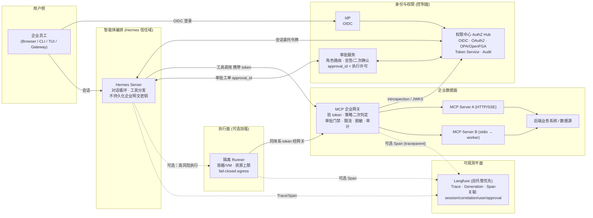
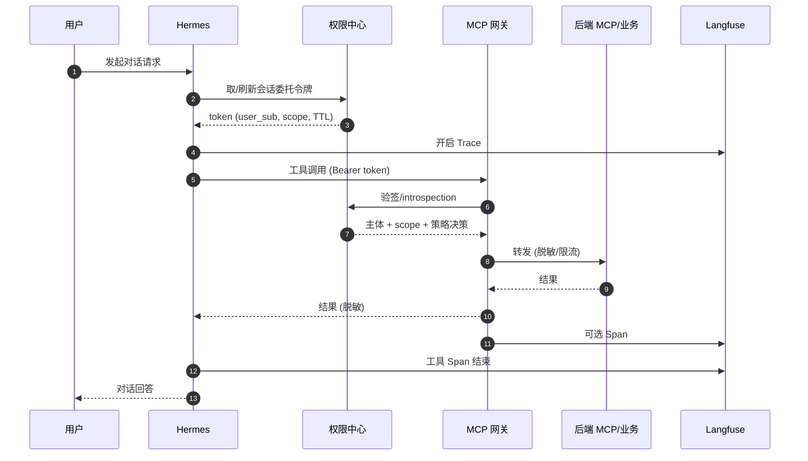
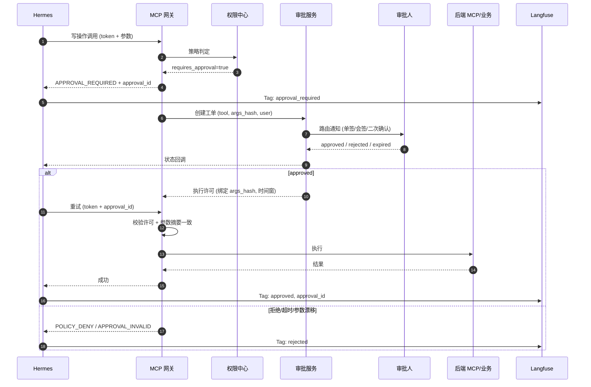
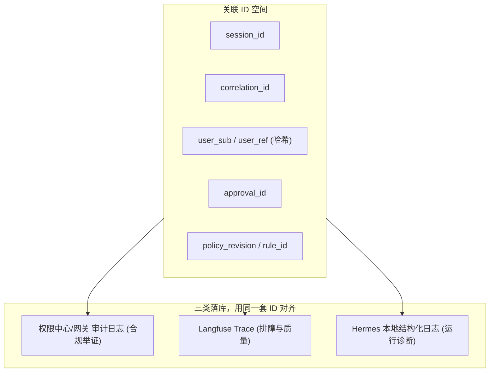

# Hermes 企业服务端部署：MCP 统一权限中心、沙箱与高风险写审批

**状态**：已评审（brainstorming 三节确认）  
**日期**：2026-04-20  
**范围**：单租户部署；组织内用户数据权限不同；智能体侧 MCP 调用统一走权限中心令牌；高风险写操作人工审批（按角色配置审批链/二次确认）；**可观测性通过 Langfuse 汇聚**（LLM 追踪、工具/MCP 跨度、与审计 ID 关联）。

---

## 1. 背景与目标

### 1.1 现状锚点（Hermes 仓库）

- **编排面**：`run_agent.py` 同步对话循环；工具经 `model_tools.py` 分发；MCP 由 `tools/mcp_tool.py` 接入（stdio/HTTP），配置在 `mcp_servers`。
- **交互审批**：CLI/Gateway/TUI 已有 approval/clarify 等回调路径；企业化需升级为**可策略化、可审计、可多审批人**的控制面。
- **执行隔离**：已有代码执行与多后端终端环境等方向；企业方案需将**数据面调用**与**不可信执行面**分层。

### 1.2 目标

1. **单租户、多用户权限**：任一 MCP 能力调用必须绑定可识别用户上下文与最小权限 scope，禁止混用超级服务账号绕过（除非在权限中心内完成 OBO 且可审计）。
2. **统一权限中心（标准取向）**：OIDC 登录、OAuth2 授权、细粒度策略（OPA 或 OpenFGA）；Hermes 仅持有权限中心体系内的 **会话委托令牌**（及按需换发的更短 TTL、更小 scope 的 step token）。
3. **A + B 收敛**：用户直连凭据与服务账号 + OBO 的差异**只在权限中心内部**消化；对 Hermes 暴露为同一种「带范围、可审计的调用凭证」。
4. **人工审批**：覆盖**高风险写操作**；审批人/会签/二次确认**按角色与组织**配置。
5. **沙箱**：企业数据面走 token + MCP 网关策略；不可信执行（代码/命令/浏览器等）走隔离 Runner，默认 fail-closed 出网策略。
6. **可观测性（Langfuse）**：将 **对话轮次、模型调用、工具/MCP 调用、延迟与错误** 以统一 Trace 汇聚到 Langfuse；与 `session_id`、`correlation_id`、`user_sub`（或企业内用户哈希）、`approval_id` **可关联查询**；支持自托管部署以满足数据驻留；**不向 Langfuse 写入令牌、密钥、完整未脱敏 PII**（见 §4.6）。

### 1.3 非目标（本规格不展开）

- 多租户 SaaS 计费与租户间强隔离的完整方案。
- 具体 IdP 厂商适配细节（仅要求 OIDC 标准集成面）。
- 替换 Hermes 核心对话产品形态（CLI/Gateway/TUI）——仅定义服务端企业安全边界与对接契约。

---

## 2. 方案选型结论

| 方案 | 摘要 | 结论 |
|------|------|------|
| **方案 1：MCP 企业网关 + Hermes 薄客户端** | Hermes 只编排；企业 MCP 经统一网关：验 token、策略、审批门禁、审计、转发 | **主选** |
| **方案 2：仅在 Hermes 内做策略钩子** | 调用前 OPA/OpenFGA；stdio MCP 仍在编排进程信任域 | 不推荐作为主架构（隔离与一致治理弱） |
| **方案 3：外置 Runner** | 执行在容器/VM；仅接受中心 mint 的短时窄 scope token | **叠加**：用于高风险执行类工具 |

**推荐组合**：以 **方案 1** 为数据面主干；对执行面按风险 **局部叠加方案 3**。

---

## 3. 架构边界（逻辑分层）

1. **身份与权限**：IdP → OIDC → 权限中心（会话、授权、策略、审计、审批工单、令牌服务）。
2. **智能体编排**：Hermes Server（对话状态、工具循环；不改变「对话中途破坏 prompt 缓存」的现有约束）。
3. **企业工具平面（数据面）**：MCP 企业网关 → 后端 MCP / 业务 API（HTTP/SSE 优先；stdio 类经 worker 包装）。
4. **执行平面**：隔离 Runner（可选加强），承载不可信执行；若需触达企业数据，仍须走同一 MCP 网关与同体系 token。
5. **可观测平面**：**Langfuse**（推荐 **自托管** 与企业 VPC 同域）；摄取来自 Hermes、可选来自 MCP 网关/Runner 的跨度；与权限中心审计并存——**Langfuse 偏运行与排障，审计日志偏合规举证**，二者通过相同关联 ID 串联。

---

## 4. 关键组件

### 4.1 IdP

员工身份源；通过 **OIDC** 与权限中心集成。

### 4.2 权限中心（AuthZ Hub）

- **认证**：OIDC 登录、会话管理；可选风险信号（设备、异地等）。
- **授权**：OAuth2 风格对接下游；内部完成用户凭据与服务账号 OBO 的收敛。
- **策略**：OPA（Rego）或 OpenFGA；输入至少包含：`user`（sub）、`roles`、目标 `mcp_server`/`tool`、`action`、资源标签、`session_id`、可选 `risk_signals`。
- **令牌服务**
  - 对 Hermes：**会话委托令牌**（JWT 或 opaque + introspection）；刷新、旋转、吊销、闲置超时策略明确。
  - 对 MCP 网关：可换发 **step token**（更短 TTL、更小 scope，可按需一步一换）。
- **审计**：认证与授权决策、令牌签发/换发、审批事件；字段需支持事后举证：`who`、`when`、`what`（资源与操作摘要）、`policy_revision`、`approval_id`（如适用）。

### 4.3 Hermes Server（编排面）

- 不长期保存企业系统明文根密钥；仅持中心体系内令牌及刷新逻辑。
- 每次 MCP 调用携带委托令牌（及网关要求的 step token）；`correlation_id` / `session_id` / `user_sub` 由 token 或受信头传递（**禁止**由模型随意伪造为信任根，须与验签/introspection 一致）。
- 收到 `APPROVAL_REQUIRED` 时进入**可恢复等待**；批准后**重试**须绑定审批许可与参数摘要（防参数漂移）。

### 4.4 MCP 企业网关（Tool Plane Gateway）

企业数据面**唯一入口**（对齐「智能体永远走 token」）。

- **验 token**：签名验证或 introspection；拒绝过期与吊销令牌。
- **策略二次判定**：即使 Hermes 被提示注入或参数篡改，网关在出站前再次判定。
- **审批门禁**：高风险写须校验有效 `approval_id` / 执行许可；过期、拒绝、参数不一致则 fail。
- **限流/配额**、**响应脱敏与大小限制**、**审计**。
- **后端形态**：优先 HTTP MCP；stdio MCP 经远端 worker/Job，避免在 Hermes 进程内任意 `subprocess`。

### 4.5 审批服务（可独立或与中心同部署）

- **触发**：策略或工具元数据标记为高风险写 → `requires_approval`。
- **路由**：按角色/组织解析审批人；支持会签/或签、二次确认（SoD）。
- **产物**：`approval_id` + **短时执行许可**（绑定：`tool`、规范化参数或 `arguments_hash`、时间窗、环境）。
- **通知 Hermes**：轮询、Webhook 或消息队列；状态：`approved` / `rejected` / `expired`。

### 4.6 Langfuse 与可观测性

**定位**：Langfuse 作为 **LLM 与应用编排可观测性** 的聚合点（Trace / Generation / Span / Score），补齐「只看审计日志不够排障」的缺口；**不替代**权限中心与网关的合规审计。

**部署**：默认 **企业自托管 Langfuse**（与 Hermes、网关同安全域或受控出站）；若使用 Langfuse Cloud，须经企业安全评估与 DPA，并满足数据驻留要求。

**摄取范围（建议）**

| 来源 | 建议事件/跨度 | 备注 |
|------|----------------|------|
| Hermes | `trace` = 一次用户任务或会话内连续轮次；子 Span：每次 `chat.completions`、每次工具调用 | 与 OpenTelemetry trace context 或 Langfuse SDK 对齐 |
| MCP 企业网关（可选） | 出站 MCP 调用 Span：工具名、延迟、状态码、**参数/响应摘要或哈希** | 完整 body 默认不上传；敏感字段脱敏 |
| Runner（可选） | 执行类 Span：镜像/资源 ID、时长、退出码 | 不传宿主路径与密钥 |

**关联 ID（强制约定）**

- 每条 Trace 携带：`session_id`、`correlation_id`（或等价 request id）、`user_sub` 或经哈希的 `user_ref`（禁止仅依赖邮箱明文若策略不允许）。
- 命中审批时写入 `approval_id`、`policy_hit`（策略规则 id 或摘要）。
- 与 **权限中心审计**、**网关审计** 使用相同 ID 空间或可查询映射，便于「一次事故 → 三处日志对齐」。

**隐私与安全**

- **禁止**上报：访问令牌、refresh token、API Key、`Authorization` 头、step token 明文。
- **Prompt/Completion**：按企业分级脱敏或截断；默认可对工具返回中的表格/PII 做 redaction 后再入 Langfuse。
- **采样与留存**：配置采样率、TTL 与导出策略；高敏环境可仅保留 **元数据 Trace**（无正文）。

**运维**：监控 Langfuse 写入失败应 **降级为仅本地日志**，不得阻塞对话主路径；可选异步队列削峰。

---

## 5. 数据流

### 5.1 登录与会话

用户 → IdP → 权限中心建立会话 → Hermes 获取并维护**会话委托令牌**（含刷新策略）。

### 5.2 读路径（无审批）

Hermes →（委托/step token）→ MCP 网关 → 验 token + 策略允许 → 后端 MCP → 响应（可脱敏）→ 审计。

### 5.3 高风险写路径（审批）

1. Hermes 发起写操作 → 网关/中心策略返回 `APPROVAL_REQUIRED` 与工单信息。  
2. Hermes 进入等待；审批人处理。  
3. 通过后签发执行许可（绑定参数摘要）。  
4. Hermes **携带 `approval_id`/许可**重试 → 网关验证 → 执行 → 审计闭环。

### 5.4 Token 与 A/B 收敛

- Hermes 侧不区分 A/B；令牌均由权限中心体系签发。  
- 中心内部：A 为用户授权链托管；B 为服务账号仅中心可见，对外仅 OBO/委托 token，并审计「代表用户 U」。

### 5.5 可观测性数据流（Langfuse）

1. 用户请求进入 Hermes → 创建或继承 **根 Trace**（写入 `session_id`、`correlation_id`、`user_ref`）。  
2. 每次模型调用 → **Generation**（模型名、token 用量、延迟、错误；正文按策略脱敏）。  
3. 每次工具/MCP 调用 → **Span**（工具名、成功/失败、耗时；参数/结果摘要或哈希）。  
4. 审批分支 → 在 Trace 上打标签或 Span：`approval_required`、`approval_id`、`approved/rejected`。  
5. （可选）MCP 网关在出站前后各打 **子 Span** 或通过 W3C `traceparent` 与 Hermes 共用同一 Trace，便于端到端延迟分解。

---

## 6. 沙箱与企业隔离

### 6.1 数据面

- 经 MCP 网关；网络层默认禁止 Hermes 直连企业 API（除白名单）。  
- 网关到后端走内网/服务网格。

### 6.2 执行面

- 容器/VM 类 Runner；资源与并发上限；默认 **fail-closed egress**（允许列表与审计）。  
- Runner 访问企业能力时仍走**同一网关与同体系 token**。

### 6.3 与 Hermes 代码库的关系

企业化实施时，将「能触企业数据的 MCP」与「高权限执行工具」划分到**不同信任域进程**，避免同进程同凭据混用。

---

## 7. 错误处理约定

| 场景 | 行为 |
|------|------|
| 策略拒绝 | 返回稳定错误码（如 `POLICY_DENY`）；用户可见简短原因；审计详单不含敏感 payload |
| 需审批 | `APPROVAL_REQUIRED` + `approval_id` + SLA 提示 |
| Token 过期/吊销 | 尝试刷新；失败则重新认证或按策略只读降级 |
| 网关/中心故障 | **默认 fail-closed**；写操作禁止「悄悄成功」 |
| 参数与审批绑定不一致 | 拒绝执行；需重新发起或重新审批 |

---

## 8. 测试与验收标准（完成定义建议）

1. **越权**：用户 A 无法访问用户 B 权限外资源（含篡改资源标识符）。  
2. **审批**：高风险写无审批必失败；通过后仅在许可窗口成功；**改参数须重新审批**。  
3. **令牌**：过期/吊销不可用；scope 收窄后不可扩权回退。  
4. **审计**：企业写操作可追溯 `who/when/what/policy_revision/approval_id`。  
5. **执行面**：Runner 默认无任意公网渗出；允许的 egress 有审计。  
6. **韧性**：依赖故障时符合 fail-closed 预期。  
7. **Langfuse**：任一完整对话任务在 Langfuse 中可检索到对应 Trace；`correlation_id` 与审计日志可交叉验证；**抽检确认**无令牌/密钥进入 Langfuse payload；Langfuse 不可用时 Hermes **仍可完成对话**（观测降级）。

---

## 9. 后续工作入口

本文件为**设计规格**。实施前应由维护者基于本规格编写 **implementation plan**（文件级变更、网关协议、Hermes 挂钩点、**Langfuse SDK/OTLP 接入点**、迁移与回滚），并单独走代码评审与测试计划。

---

## 10. 规格自检记录

- **占位符**：无 TBD/TODO。  
- **一致性**：单租户多用户、统一 token 面、网关唯一数据面入口、审批仅高风险写，与全文一致。  
- **范围**：单实现计划可覆盖「网关 + 中心集成 + Hermes 编排改造 + Runner 可选 + Langfuse 自托管与 SDK 接入」；若一期仅上网关与 token，Runner 与网关侧 Span 可作为二期。  
- **歧义消除**：「智能体永远走 token」定义为经权限中心签发的委托/step token，经 MCP 企业网关校验；非 Hermes 自建长期 API Key 直连接口。  
- **可观测性**：Langfuse 为**排障与质量**主用；合规举证仍以权限中心/网关**审计日志**为准；二者通过 `correlation_id` / `session_id` / `approval_id` 对齐。

---

## 11. 架构图

### 11.1 组件全景

### 11.2 读路径（无审批）

### 11.3 高风险写 + 人工审批

### 11.4 关联 ID 与三类落库

